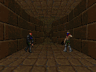
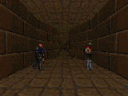

# doom-vector

A self-learning Doom agent built on **ViZDoom** (environment) + **RuVector** (`ruvector-core`, the reward-aware vector memory that does the "learning"). The agent acts by *recall* — episodic control — rather than gradient-trained deep RL, so it can "learn" with no training step and run on tiny hardware. **Stretch target: a Raspberry Pi Zero 2 W (512 MB, no GPU).**

**It works:** on ViZDoom's `basic`, the agent learns from a random baseline of **−152** to a **positive score in under 25 episodes** (holding +30 to +50) — using a ~33-dim structured state encoder, the native RuVector backend, and ~50 MiB RAM. No neural network is trained; "learning" is reward-weighted experiences accumulating in the vector memory.



*Above: a greedy `deadly_corridor` episode after ~150 episodes of learning — the agent navigates by reward-weighted recall over RuVector, with no trained network. The same brain runs real-time on a 32-bit Raspberry Pi Zero 2 W (see Tier 3 below).*



*Above: the same scenario **trained for 150 episodes and rendered entirely on the actual 32-bit Pi Zero 2 W** ("Cognitum Seed") — best greedy run +251. Frames come straight from the Seed's headless ViZDoom (`screen_buffer` fills with no display); only the GIF muxing happens on the desktop. This is the on-hardware counterpart to the higher-res desktop clip above.*

See [`docs/plans/doom-vector-self-learning-agent.md`](docs/plans/doom-vector-self-learning-agent.md) for the full design, rationale, and roadmap.

New to RuVector? [`docs/ruvector-by-example.md`](docs/ruvector-by-example.md) is a plain-language tour of every vector-DB feature this agent uses (and the ones that turned out inert), each anchored to a real call site with a figure or measured result as proof.

## Repo layout

```
envs/         ViZDoom environment factories (headless, low-res)
brain/
  encoder/    game state -> fixed-length vector
  memory/     RuVector-backed experience store (numpy fallback included)
  policy/     reward-weighted k-NN action selection (episodic control)
bridge/
  ruvector_py/  PyO3 binding -> ruvector-core (native Python module, no Node runtime)
experiments/  runnable spikes (random agent, memory loop)
eval/         scoring helpers
deploy/       cross-compile + arm64 Docker sandbox + Pi Zero 2 W setup
docs/plans/   design docs
```

## Quickstart — train & watch it learn

```bash
python3 -m venv .venv && source .venv/bin/activate   # Python 3.11/3.12 (vizdoom wheel)
pip install -r requirements.txt
pip install maturin && maturin develop --release -m bridge/ruvector_py/Cargo.toml  # native memory (optional; numpy fallback otherwise)

# train on `basic` with the structured encoder; prints a greedy-eval learning curve
python experiments/train.py --scenario basic --encoder structured --episodes 200 --eval-every 25

# learn to *aim* on defend_the_center: adds aim encoder dims (dx-to-target,
# target size, enemy-visible), enemy-visible–filtered + MMR-diverse recall, and a
# small DAMAGECOUNT hit-bonus. Eval stays on the unshaped scenario score.
python experiments/train.py --scenario defend_the_center --encoder structured --aim --episodes 300

# record a greedy episode, then replay it in a window (on a desktop)
python experiments/train.py --episodes 200 --record demo.lmp
python experiments/replay.py demo.lmp --scenario basic
```

The `structured` encoder (game variables + labeled-object geometry) beats the
`thumbnail` pixel encoder decisively on `basic` — use it. Add `--aim` (Track 1)
to turn on metadata-filtered, MMR-diverse recall plus hit-bonus reward shaping
for combat scenarios like `defend_the_center`.

## Phase 0 — validation tiers (emulate to build, Pi to prove)

### Tier 0 — desktop spike (x86, fastest)
```bash
python3 -m venv .venv && source .venv/bin/activate   # use Python 3.11/3.12 if vizdoom has no wheel for yours
pip install -r requirements.txt
python experiments/spike_random_basic.py             # ViZDoom Basic, random agent: prints reward + RSS
python experiments/spike_memory_loop.py              # ViZDoom + RuVector memory loop (numpy fallback if binding unbuilt)
```

### Tier 1 — build the native RuVector binding
```bash
pip install maturin
maturin develop -m bridge/ruvector_py/Cargo.toml --release   # installs `ruvector_py` into the venv
python -c "import ruvector_py; m=ruvector_py.RuVectorMemory(3); m.insert([0.1,0.2,0.3]); print(m.search([0.1,0.2,0.3],1))"
```
Now `spike_memory_loop.py` uses the native backend instead of the numpy fallback.

### Tier 2 — aarch64 correctness sandbox (Docker)
```bash
bash deploy/setup_binfmt.sh                          # x86 hosts only; skip on Apple Silicon (native arm64)
bash deploy/build_pyo3_arm64.sh                      # cross-compile the arm64 wheel (maturin + zig)
docker build -f deploy/Dockerfile.arm64 -t doom-vector:arm64 .
docker run --rm --memory=512m --memory-swap=512m doom-vector:arm64   # early OOM signal; timing is NOT meaningful
```
On an **Apple Silicon Mac** this runs natively (real NEON, fast). On **WSL/x86** it runs under QEMU — correctness only.

### Tier 3 — the real Pi Zero 2 W (authoritative)
See [`deploy/pi_setup.md`](deploy/pi_setup.md). Flash 64-bit Pi OS Lite, enable zram, copy the arm64 wheel + code, then measure **RAM fit** (`free -m`, `deploy/measure_rss.py`) and **throughput** (steps/sec). Only this tier settles the two real gates.

## Status & verified results

- **Phase 0 (de-risked, all tiers):** ViZDoom runs headless; the PyO3 binding compiles **unmodified** against `ruvector-core` **2.2.0** on x86 **and** aarch64 (maturin + zig, ~1.8 MB self-contained abi3 wheel); the full loop runs in a **512 MB arm64 sandbox** on the native backend at ~85 MiB.
- **Phase 1 (the agent learns):** episodic control over RuVector learns `basic` from −152 → +30…+50 in <25 episodes with the structured encoder. Bounded memory (value-based eviction) verified; replay recording works. Pixel/thumbnail encoder underperforms — skip it for combat scenarios.
- **Phase 2 (path/plan prediction — resolved):** two planning extensions underperformed and a third approach won. **Option A** (open-loop trajectory retrieve-and-follow) is flat on dynamic `health_gathering` and only bumps slightly on the static `my_way_home` maze — replay transfers only in static worlds. **Option B** (model-based rollout planning with an all-Rust RuVector forward model) compiles and runs but **collapses to no-op** on `health_gathering` (the dense living reward is constant across actions → no gradient) and is **~3–5 decisions/s on a Pi (too slow for real-time)**. A closed-loop **reactive value-vote** on the navigation encoder is the resolution. Once the encoder included **HEALTH** (initially missing — the decisive survival variable), `health_gathering` flipped from drifting below random to learning (~320 → ~400, peak 492). And **`deadly_corridor`** (distance-shaped reward) learns strongly: **−30 → +330**, even with 128 actions, at ~57 MiB. So there are now **three learning scenarios** on one recipe — reactive value-weighted per-step recall over RuVector: `basic` (combat), `health_gathering` (survival), `deadly_corridor` (navigation). Open-loop trajectory replay (A) and the reward-sum world-model rollout (B) were the wrong mechanisms; value-weighted recall with an adequate state encoding is the right one.
- **SONA evaluated, skipped:** `ruvector-sona`'s recall ranks by cosine only (never re-ranks by reward), so it adds nothing over our reward-weighted k-NN. Revisit only if upstream wires reward into `find_similar`.
- **Tier 3 — runs on real hardware (Pi Zero 2 W "Cognitum Seed", 32-bit Raspbian):** the RuVector brain was cross-built for armv7 and benchmarked on the actual A53 — **~40 MiB at 20k experiences, ~270–510 recall/s (≈ decisions/s, ~30–55× the real-time bar)**. Three fixes were needed (all in the binding): cross-build for `armv7-unknown-linux-gnueabihf`; **bound `max_elements`** (default 10M pre-allocates ~661 MB → OOM); **disable the `simd` feature** (`simsimd` segfaults on armv7; scalar fallback is free at low dim). The brain is comfortably real-time on a $15 32-bit Pi. And the **full agent now runs on-device**: ViZDoom was source-built for armhf (QEMU cross-build, since no 32-bit wheel exists) so the *environment* runs on the Seed too — `basic` learns **−118 → +92 in 30 episodes at ~27 MiB**, the complete loop (environment + self-learning brain) on a 32-bit $15 Pi. Required switching the distance metric to Euclidean (the scalar cosine fallback returns negative distances on armv7 and panics hnsw_rs). See [`deploy/pi_setup.md`](deploy/pi_setup.md).
- **Tier 3 — at scale on-device (both navigation scenarios learn):** the full agent runs longer, harder runs on the Seed. **`deadly_corridor`** (128 actions, 2 seeds) climbs from a −29/−49 random baseline to **+218…+263** — reproducing the desktop +330 result on real 32-bit hardware — at a flat 27→36 MiB. **`health_gathering`** (survival) reaches a **+1097** peak (3× its random baseline) while memory grows to the **20k cap, where value-based eviction engages and bounds RSS at 51 MiB with no OOM**. A cap-3000 eviction-churn run confirms memory pins exactly at the cap (RSS bounded; a slow ~37 KB/episode HNSW-tombstone creep is the only caveat for very long runs). Greedy eval is high-variance, so learning is read from the trend + peaks, not a single converged number.
